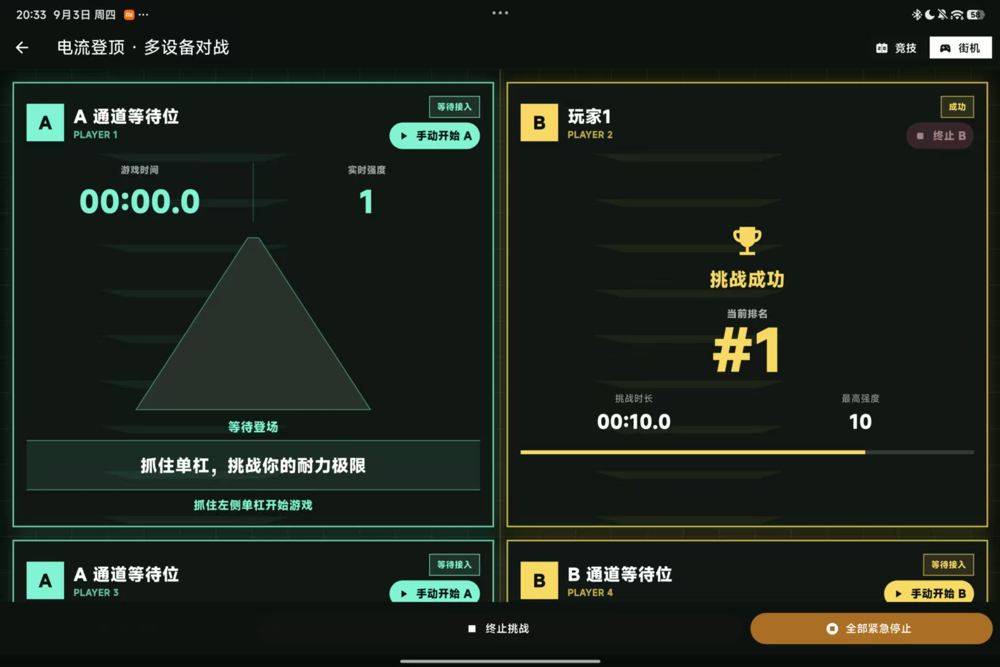
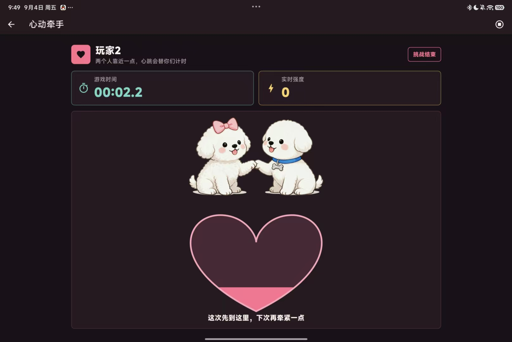
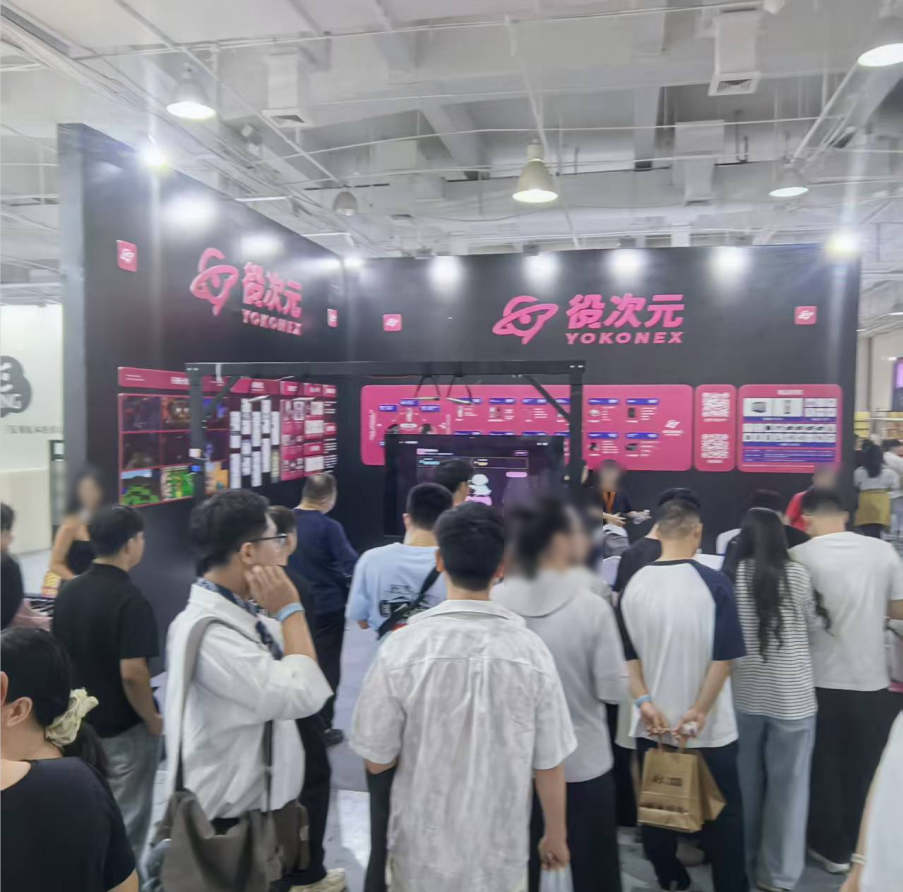

# 役次元 · 心动挑战

**好玩的创意，欢迎一起用。**

这是役次元的心动挑战游戏。我们把它开源，让玩家、开发者和同行都能拿去研究、修改，共同创造“自信自爱，方得自由”的役次元社区。

# 玩法

### 电流登顶 · 单杠挑战

玩家双手抓住单杠，设备检测到通道接通后自动触发预设配置并开始计时挑战，实时强度随耐力时长逐步提升；支持多台设备同时接入，按挑战时长统一排名，实时展示各玩家的排位与状态。

### 心动牵手 · 双人挑战

两名玩家手拉手，通道接通后即触发设备开始游戏，用牵手时长为彼此计时，实时强度随互动变化，用心跳与陪伴共同完成挑战。

## 现场照片

## 好玩的点子，值得有更多版本

心动挑战从一个想法变成了可以玩的游戏，现在，我们把代码也一起分享出来。

喜欢这个玩法，欢迎直接拿去用；有自己的想法，欢迎在它的基础上继续改。玩家、开发者、同行，都可以从这里开始。

**这份玩法，大家尽管用。役次元继续琢磨下一份心动。**

## 免费开源，允许商用，友商也欢迎

本项目采用 [MIT 许可证](https://opensource.org/license/mit)。简单说，你可以：

- 免费使用、复制和分享本项目。
- 修改代码，做成自己的版本。
- 用在商业产品、收费项目或线下经营活动中。
- 作为友商，把代码用进自己的产品，无需另行向我们申请授权。

## KTV、酒吧需要？可以免费聊聊

如果你经营 KTV、酒吧，想把心动挑战用在店里，欢迎联系我们，我们可以提供免费的咨询服务。

## 开始体验

游戏体验或下载：https://github.com/YCY-YOKONEX/Yokonex-Heartbeat-Challenge/releases

欢迎来玩，也欢迎拿去做出更好玩的版本。
